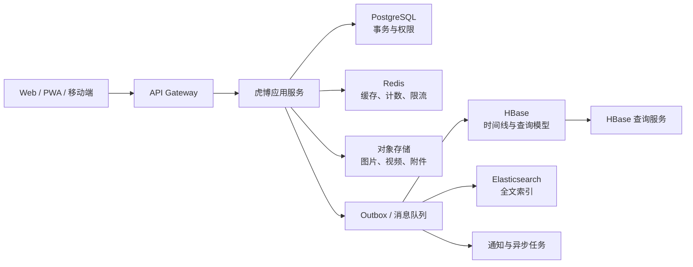

# 虎博（panghu_chat）

虎博是一套面向朋友和小型社群的微博/博客系统。系统同时支持短动态和长文章，并以 PostgreSQL、HBase、Redis、Elasticsearch 和对象存储组成可逐步扩展的数据基础设施。

## 设计目标

- 先满足朋友规模的稳定使用，不在第一版引入不必要的复杂推荐系统。
- 使用事务数据库保证账号、关系、权限和内容状态的一致性。
- 使用 HBase 承载时间线、Feed、评论等高频追加和范围查询。
- 使用 Elasticsearch 提供动态、文章、标签和用户的全文搜索。
- 所有跨存储写入通过事件异步完成，并支持幂等重试。
- 保留从模块化单体演进到事件驱动服务集群的空间。

## 总体架构

第一阶段采用模块化单体：账号、社交关系、内容、Feed、互动、搜索和管理后台在一个后端工程内保持清晰模块边界；异步 Worker 通过事件处理 HBase、ES、通知和统计。只有当流量和团队边界明确后再拆分微服务。

## 存储职责

| 组件 | 职责 | 说明 |
| --- | --- | --- |
| PostgreSQL | 用户、关注关系、权限、文章元数据、草稿、举报、审计、Outbox | 系统事务主库 |
| HBase | 文章/动态查询模型、用户时间线、首页 Feed、评论列表 | 面向 RowKey 范围扫描优化 |
| Redis | 会话、热点内容、Feed 缓存、限流、计数聚合 | 不作为永久主库 |
| Elasticsearch | 动态、长文、标签、用户名全文搜索 | 只作为可重建索引，不能作为主库 |
| S3/MinIO/Ceph RGW | 图片、视频、附件 | 媒体不写入 HBase |
| Kafka/Redpanda | 发布、评论、点赞等事件分发 | 没有消息队列时可先用 Redis Streams |

对于朋友规模的第一版，可以先把正文保存在 PostgreSQL，并让 HBase 承载时间线和查询副本。完成压测后，再按需要迁移正文到 HBase，避免跨数据库事务成为早期复杂度。

## 第一版功能

- 邀请制注册、登录、个人资料
- 短动态：文字、图片、链接、话题
- 长文章：Markdown/富文本、草稿、发布、编辑和版本
- 关注、取消关注和个人主页
- 首页时间线，默认按发布时间倒序
- 点赞、评论、转发
- 可见范围：公开、仅关注者、指定圈子、仅自己
- 动态、文章、标签和用户搜索
- 通知中心
- 管理后台：用户、内容、举报、屏蔽和审计日志

第一版暂不做复杂推荐，先保证时间线、搜索、权限和删除流程可靠。

## 关键流程

### 发布动态

1. 应用服务校验登录状态、内容和可见范围。
2. 在 PostgreSQL 中写入 `posts_meta` 和 `outbox_events`。
3. 事务提交后，事件分发器发送 `PostPublished` 事件。
4. HBase Worker 写入作者时间线和关注者 Feed。
5. Elasticsearch Worker 建立搜索索引。
6. 通知 Worker 生成通知。
7. 统计 Worker 聚合阅读数、点赞数等指标。

事件需要包含 `event_id`、`event_type`、`aggregate_id`、`version`、`created_at` 和 `payload`，所有消费者必须支持重复消费和失败重试。

### Feed 生成

- 普通用户使用推模式：发布时写入关注者的 `feed_inbox`，首页读取速度稳定。
- 关注者很多的用户使用拉模式：读取首页时合并作者时间线。
- 最终采用推拉结合，热点账户不会导致一次发布产生大量同步写入。

### 搜索

1. ES 查询候选 `post_id`。
2. 应用层根据当前用户重新校验可见权限、屏蔽关系和删除状态。
3. 批量从 PostgreSQL/HBase 加载完整内容。
4. 使用游标返回结果，不使用大页码 `offset`。

## 推荐技术栈

- 后端：Java 21 + Spring Boot，HBase 和 ES 客户端成熟
- 前端：Vue/Nuxt 或 React/Next.js，优先做响应式 Web/PWA
- 数据：PostgreSQL、HBase、Redis、Elasticsearch
- 消息：Kafka/Redpanda；早期可用 Redis Streams
- 媒体：MinIO 或 Ceph RGW
- 部署：Docker、Kubernetes、Helm
- 监控：Prometheus、Grafana、Loki

如果团队更偏 Python，可以使用 FastAPI，但后端建议保持单一主语言，避免不同模块形成两套运行和治理体系。

## 文档索引

- [架构设计](docs/architecture.md)：服务模块、数据流、权限和可靠性
- [数据模型](docs/data-model.md)：PostgreSQL 表、HBase RowKey 和 ES 文档
- [实施路线](docs/roadmap.md)：从 MVP 到数据平台能力的分阶段计划

## 当前状态

项目处于设计阶段，暂未实现业务代码。后续实现顺序建议为：领域模型和权限 -> 内容发布 -> 时间线 -> 互动 -> 搜索 -> 管理后台 -> 统计与推荐。
